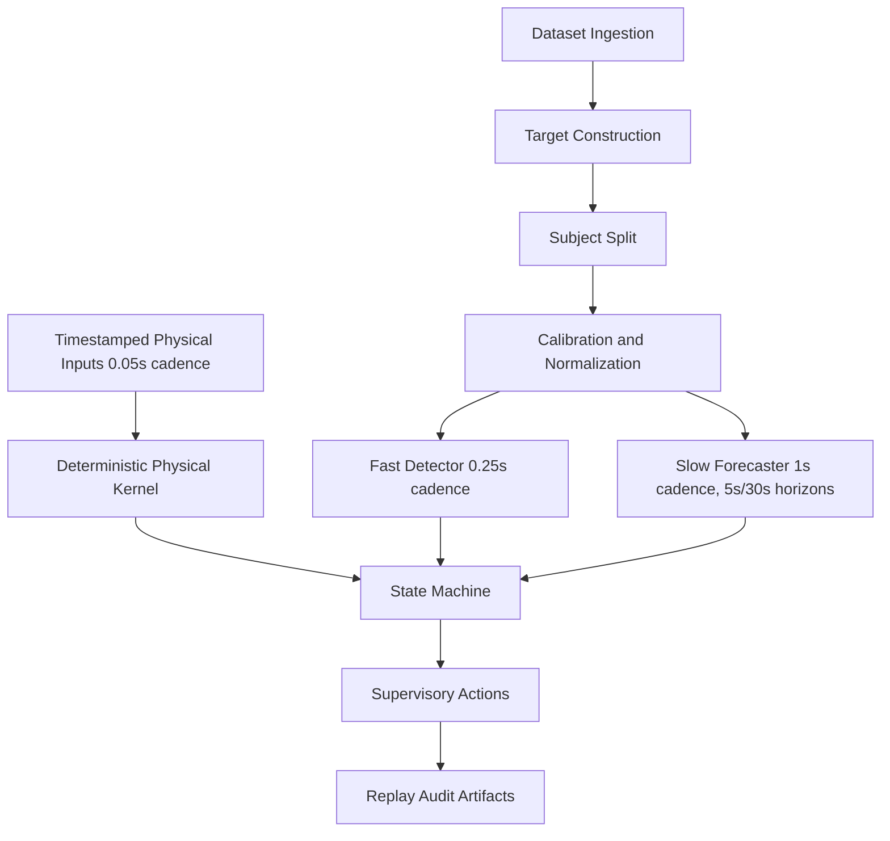

# Final Architecture

The repository implements duration-based physiological data processing, subject-aware benchmarks, fast current-state detection, slow multi-horizon forecasting, and a replayable supervisory policy architecture.

Physiological ML is outside any certified emergency-stop chain. Physical emergency and protective rules have higher authority than ML layers. The physical kernel is configurable deterministic logic inspired by separation-monitoring and stopping-distance principles; it is not an ISO-compliant implementation.

Artifact provenance is saved through config hashes, artifact paths, artifact hashes, split subjects, target definitions, timing settings, and model version fields where prediction artifacts are available.

