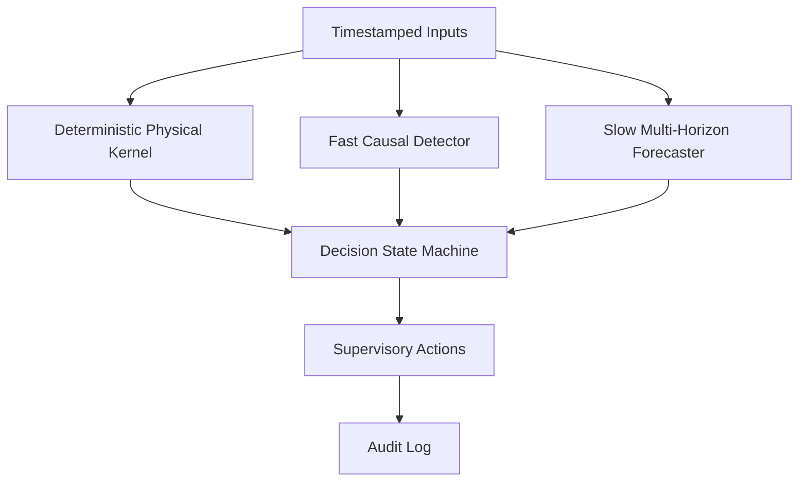

# Multi-Rate Supervisory Architecture

Date: 2026-07-23

This phase implements a software architecture for timestamp-driven supervisory evaluation. It does not provide safety certification, ISO compliance, construction deployment validation, hardware actuation, or incident-reduction evidence.

## Authority Hierarchy

The authority order is strict:

```text
Hard physical emergency
    >
Physical protective rule
    >
Fast acute physiological/context detector
    >
Slow physiological forecast
    >
Normal operation
```

A lower-priority layer cannot reduce or override the action requested by a higher-priority layer.



## Layers

| Layer | Module | Cadence | Authority | Notes |
| --- | --- | --- | --- | --- |
| Physical kernel | `src/safety/physical_kernel.py` | Physical input timestamps, configured target `0.05s` | Highest | Configurable deterministic safety logic inspired by separation-monitoring and stopping-distance principles; no ML dependency. |
| Fast detector adapter | `src/safety/adapters.py` | Fast cadence, configured `0.25s` | Medium | Continuous physiological stress-state policy with hysteresis and persistence. Physiology cannot request emergency stop. |
| Slow forecaster adapter | `src/safety/adapters.py` | Slow cadence, configured `1.0s` | Advisory | Experimental physiological stress forecast with separate 5s and 30s horizons. It may request caution-level recommendations only. |
| State machine | `src/safety/state_machine.py` | Every replay event | Arbitration | Enforces latching, reset, cooldown, and priority rules. |

## States

`NORMAL`, `CAUTION`, `HIGH_ALERT`, `CONTROLLED_STOP`, `DEGRADED`, `PROTECTIVE_STOP`, and `EMERGENCY_STOP`.

`EMERGENCY_STOP` is latched. It requires explicit reset, emergency condition cleared, valid physical inputs, and the configured reset hold time. Invalid or stale physical inputs trigger degraded or protective behavior according to configuration; the implementation must not silently continue normal operation with invalid required physical inputs.

`DEGRADED` is represented as a state in the current implementation so artifacts and tests can assert a concrete output. Semantically it is a system-health condition with an associated configured action (`controlled_stop` by default), not evidence of physiological severity. It remains below physical protective and emergency stops and above ML advisory states in the current priority table to avoid stale or invalid required inputs being cleared by normal ML outputs.

## Actions

Actions are recommendations or commands for a supervisory layer, not direct hardware actuation:

| State | Default action |
| --- | --- |
| `NORMAL` | `continue_normal` |
| `CAUTION` | `reduce_speed` |
| `HIGH_ALERT` | `request_operator_attention` |
| `CONTROLLED_STOP` | `controlled_stop` |
| `DEGRADED` | `controlled_stop` |
| `PROTECTIVE_STOP` | `protective_stop` |
| `EMERGENCY_STOP` | `emergency_stop` |

Every action includes `action_name`, `priority`, `source_layer`, `reason_code`, `parameters`, and `timestamp`.

## Hysteresis

The fast detector has separate activation and release thresholds plus consecutive-positive and consecutive-negative counters. The release threshold must be below the activation threshold.

The slow forecaster has independent policies for 5s and 30s horizons. The horizons are not averaged. A slow 5s warning can recommend lower speed or increased monitoring sensitivity; a slow 30s warning can recommend a planned pause at a task boundary. Slow physiology cannot request protective or emergency stop.

## Replay Modes

| Mode | Label | What it validates | What it does not validate |
| --- | --- | --- | --- |
| `physiological` | real physiological replay | WESAD stress-state policy transitions from real physiology-derived timestamps | Physical robot safety, construction hazards, collision risk, near misses |
| `synthetic_physical` | synthetic physical safety simulation | Deterministic physical kernel and state-machine rules | Empirical safety performance |
| `combined_simulation` | combined integration simulation | Priority, persistence, stale handling, reset behavior, replay determinism | Real-world deployment validity |

Modes B and C are software-only simulations and must not be called empirical validation.

## Scientific Limits

The fast model status is WESAD current physiological stress-state detection. The slow model status is WESAD protocol stress forecasting at 5s and 30s horizons. WESAD labels are long contiguous experimental protocol blocks, so 5s and 30s targets are frequently identical after boundary-crossing windows are removed. Strong slow-model ranking does not demonstrate useful real-world early warning.

The local MultiPhysio data has no raw or filtered high-rate physiological streams. Neither WESAD nor local MultiPhysio contains complete robot distance, velocity, stopping-distance, construction near-miss labels, or physical hazard-event ground truth.
